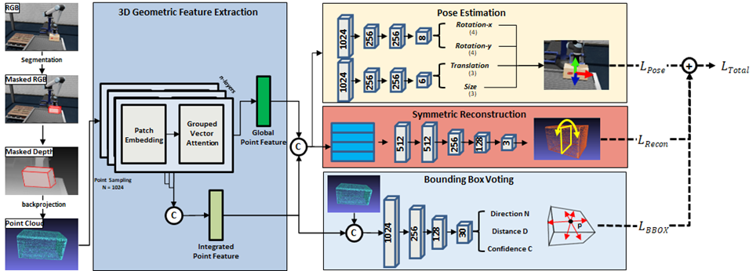

# KOPE
Pytorch implementation of KOPE: Category-level Object Pose Estimation 



## Required environment

- Ubuntu 18.04
- Python 3.8 
- Pytorch 1.10.1
- CUDA 11.3.
 

## IsaacSIMDataset Preparation
Download the IsaacSIMDataset [link](https://drive.google.com/file/d/1Y9YMRH6dRzuOWFrcVYkAd-rEVgaLTv9j/view?usp=sharing).

Download the IsaacSIMObjectModel [link](https://drive.google.com/file/d/1owc2MXld1Yw2ITblFigT-pVCY_hDAZzf/view?usp=sharing).

## File Root

* /Temp_ws
    * /KOPE
    * /data
       * /IsaacSIM
       * /obj_models

## Trained model
Download the trained model from this [link](https://drive.google.com/file/d/1bK99MFeZm7CXVA45xUdvUQ0irtiBKgUV/view?usp=sharing).

## Training
Please note, some details are changed from the original paper for more efficient training. 

Specify the dataset directory and run the following command.
```shell
python -m engine.train --data_dir YOUR_DATA_DIR --model_save SAVE_DIR
```

Detailed configurations are in 'config/config.py'.

## Evaluation
```shell
python -m evaluation.evaluate --data_dir YOUR_DATA_DIR --detection_dir DETECTION_DIR --resume 1 --resume_model MODEL_PATH --model_save SAVE_DIR
```


## Acknowledgment
Our implementation leverages the code from [GPV_Pose](https://github.com/lolrudy/GPV_Pose), [PointTransformerV2](https://github.com/Gofinge/PointTransformerV2), [FS-Net](https://github.com/DC1991/FS_Net),
[DualPoseNet](https://github.com/Gorilla-Lab-SCUT/DualPoseNet), [SPD](https://github.com/mentian/object-deformnet).
